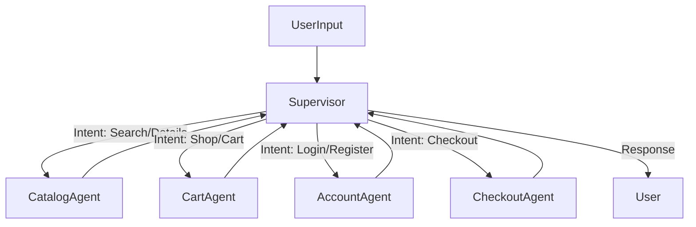

# System Architecture

The system uses a **Supervisor-Worker** multi-agent pattern built with **LangGraph**.

## High-Level Overview

## Components

### Supervisor
Routes the user's request to the appropriate specialized agent based on intent.

### Agents
- **CatalogAgent**: Handles product search and PDP (Product Detail Page) queries.
- **CartAgent**: Manages cart operations (create, add, view, merge).
- **AccountAgent**: Handles authentication flows.
- **CheckoutAgent**: Guides the user through shipping, billing, and payment to place the order.

### Service Layer
`MagentoService` (`services/magento.py`) provides a clean Python wrapper around the Magento GraphQL API.
